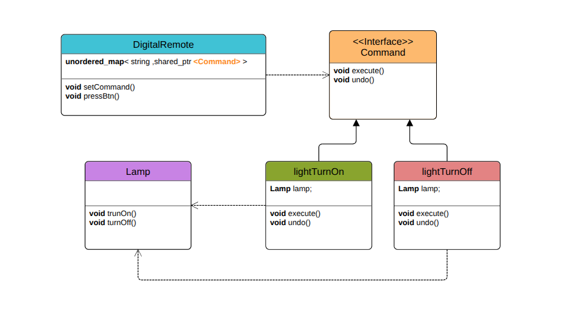

# Command Pattern

## Makes shit customizable

---

## What Are We Building?

Imagine you are building a **smart lamp application** with a remote control.  
The lamp can perform multiple actions:  

- Turn On  
- Turn Off  
- Increase Brightness  
- Decrease Brightness  

The tricky part?  
We want the **user** to decide which remote control button (red, green, blue, yellow) performs which action.  

Also, we want the design to be **flexible**:  
- Later, we might add new devices (like a fan or TV).  
- We might want undo/redo operations.  
- We want to avoid hardcoding button logic into the remote.  

This is where the **Command Pattern** shines.

---

## Overview

The **Command Pattern** is a behavioral design pattern that turns a request (like "turn on the lamp") into a **command object**.  

Instead of directly calling methods on the receiver (lamp), the remote control executes commands that **wrap these requests**.  

In short:

> A command is an object that encapsulates an action and the receiver of that action.  
> The invoker (remote control) triggers the command, without knowing the details.

---

## Diagram

## 

---

## Why Not Just Hardcode Remote Buttons?

Hardcoding the lamp operations inside the remote control leads to:

- **Rigid code** → adding new devices or actions means editing the remote control class
- **Tight coupling** → remote control directly depends on the lamp
- **No flexibility** → users can’t reassign buttons dynamically
- **Violates OCP (Open/Closed Principle)** → we must modify existing code to extend functionality

---

## Why Command Pattern Is Better

With the Command Pattern:

- Remote buttons can be dynamically mapped to any action
- Remote control only knows about the **command interface**, not lamp details
- Easily add new commands (e.g., `ChangeColorCommand`) without touching existing code
- Undo/redo is supported naturally
- Promotes **loose coupling** and **separation of concerns**

---

## Understanding the Code

### 1. [without_example.cpp](./without_example.cpp) - Hardcoded Remote Control

**Code explanation:**

- `RemoteControl` holds a direct reference to `Lamp`
- Each button press is hardcoded with `if-else` to call specific lamp methods
- User cannot customize button behavior
- Adding a new device or command requires modifying the `RemoteControl` code

### Why this is bad:

1. **Not extensible:** Can’t add new commands without changing the remote  
2. **Tight coupling:** Remote depends directly on lamp methods  
3. **Hard to reuse:** Remote cannot work with other devices (fan, TV)  
4. **Violates OCP:** Every new command forces changes in existing code  

---

### 2. [with_example.cpp](./with_example.cpp) - Command Pattern Approach with Smart Pointers

**Code explanation:**

- Defines a `ICommand` interface with `execute()` and `undo()`
- `TurnOnCommand` and `TurnOffCommand` wrap lamp actions
- `RemoteControl` holds a map of button labels → command objects
- User assigns commands dynamically at runtime
- `RemoteControl` is decoupled from the lamp, only calls `command->execute()`

### Why this is good:

- **Centralized actions:** Each command object encapsulates one operation
- **Flexible:** Buttons can be remapped at runtime
- **Reusable:** Remote can control any device with commands (not just lamps)
- **Undo support:** Command objects can implement reverse actions
- **Follows OCP:** New commands don’t require modifying remote control

---

## Key Differences Summary

| Feature             | Without Command Pattern (Hardcoded) | With Command Pattern             |
| ------------------- | ----------------------------------- | -------------------------------- |
| Button assignment   | Hardcoded in `RemoteControl`        | User-configurable at runtime     |
| Adding new command  | Modify remote code                  | Add new command class only       |
| Coupling            | Tight (remote ↔ lamp)               | Loose (remote ↔ command ↔ lamp) |
| Undo support        | Impossible                          | Easy (via command `undo()`)      |
| Reusability         | Low                                 | High                             |
| Follows OCP         |  No                              | Yes                           |

---

## Analogy

Think of it like a **universal remote**:

- **Without Command Pattern:** The remote is hardwired — the green button always turns on the lamp, red always turns it off. If you buy a new lamp or want to control a fan, you need a *new remote*.  
- **With Command Pattern:** The remote has programmable buttons. You can map green to "Lamp On," red to "Fan Speed Up," blue to "TV Volume Down," etc. The remote doesn’t care — it just executes the assigned command.

---

## Summary

The Command Pattern makes it easy to decouple requests from their execution.  
It enables **flexible, reusable, and extensible** designs for remote controls, GUI buttons, menu systems, and more.

It is especially powerful when combined with undo/redo stacks and dynamic runtime configuration.
