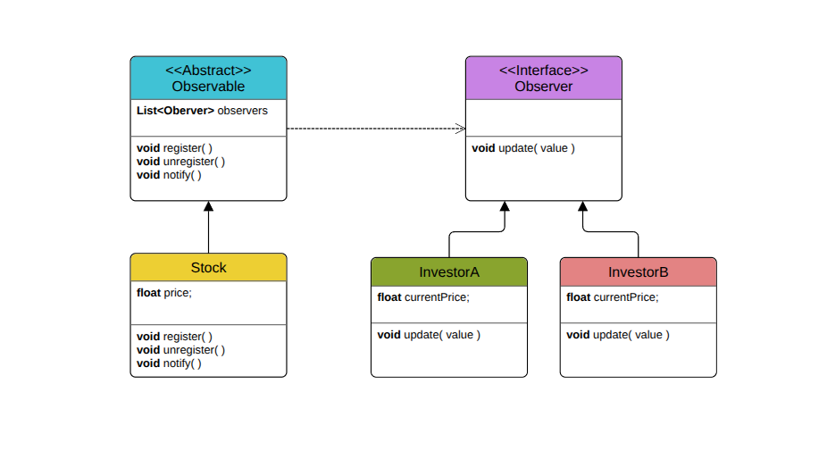

# Observer Pattern

## Keep wathcing people :|

---

## What Are We Building?

Imagine you are building a **stock market application** where multiple investors want to be notified whenever a stock price changes.  
Each investor should receive updates automatically without the stock market having to know the details of each investor.

The tricky part?  
You want to **add or remove investors dynamically** at runtime and make sure they all get notified when the stock price changes, without hardcoding each investor into your stock market class.

This is where the **Observer Pattern** is the perfect solution.

---

## Overview

The **Observer Pattern** is a behavioral design pattern that defines a one-to-many dependency between objects.  
When the state of one object (the subject or observable) changes, all its dependents (observers) are automatically notified and updated.

In short:

> Observers subscribe to a subject. When the subject changes, it notifies all subscribed observers, keeping them updated.

---

## Diagram

## 

---

## Why Not Just Hardcode Observers?

Hardcoding observers inside the subject leads to:

- Rigid code that is hard to maintain and extend
- Adding or removing observers requires modifying the subject's source code
- Violates the **Open/Closed Principle** (OCP). classes should be open for extension but closed for modification
- Does not support dynamic addition/removal of observers at runtime

---

## Why Observer Pattern Is Better

With the Observer Pattern:

- Observers **register** and **deregister** dynamically at runtime
- Subject only knows **observer interface**, not concrete classes promotes loose coupling
- Adding new observers does **not** require modifying the subject class
- Automatically notifies all registered observers on state changes
- Better separation of concerns and cleaner code

---

## Understanding the Code

### 1. [without_example.cpp](./without_example.cpp) - Hardcoded Observers Approach

**Code explanation:**

- `StockMarket` class holds hardcoded investors (`investorA`, `investorB`, `investorC`)
- `notifyInvestors()` calls each investor's `update()` method manually
- Adding a new investor means you **have to modify** the `StockMarket` class to add new investors and update notification logic

### Why this is bad:

1. **Not scalable:** Adding or removing investors requires changing the subject class code
2. **Tight coupling:** `StockMarket` depends directly on concrete investor instances
3. **No dynamic subscription:** Cannot add or remove observers at runtime easily
4. **Hard to maintain:** Changes in investor logic may force subject changes

---

### 2. [with_example.cpp](./with_example.cpp) - Observer Pattern Approach with Smart Pointers

**Code explanation:**

- Defines interfaces `IObservable` (subject) and `IObserver`
- `Stock` class implements `IObservable`, holding a list of observers (`shared_ptr<IObserver>`)
- `Investor` class implements `IObserver`
- Observers can **register** (`add()`) and **deregister** (`remove()`) themselves from the `Stock` object dynamically
- When stock price changes (`setPrice()`), `Stock` **notifies all observers** via their `update()` method
- Uses `shared_ptr` to manage observer lifetime safely

### Why this is good:

1. **Dynamic subscription:** Observers can be added or removed at runtime
2. **Loose coupling:** Subject only knows about observer interface, not concrete classes
3. **Open for extension:** New observer types can be added without changing subject
4. **Memory safe:** Using `shared_ptr` avoids manual memory management issues
5. **Clean, maintainable code:** Clear separation of concerns and responsibilities

---

## Key Differences Summary

| Feature              | Without Observer Pattern (Hardcoded) | With Observer Pattern                   |
| -------------------- | ------------------------------------ | --------------------------------------- |
| Add/remove observers | Requires modifying subject class     | Dynamic, no subject code change         |
| Coupling             | Tight coupling to concrete observers | Loose coupling via interfaces           |
| Runtime flexibility  | None                                 | Observers subscribe/unsubscribe anytime |
| Code maintainability | Low                                  | High                                    |
| Memory management    | Manual                               | Automatic with smart pointers           |

---

## Analogy

Think of it like a newsletter:

- **Without Observer Pattern:** The company must manually call each subscriber’s phone to inform news. Adding a new subscriber means adding a new line of code for them.
- **With Observer Pattern:** Subscribers sign up to the newsletter. When there’s news, the company just sends one broadcast email that all subscribers automatically get. No code changes needed when subscribers join or leave.

---

## Summary

The Observer Pattern helps build flexible, scalable event-driven systems where many components must stay synchronized without tight coupling.  
It’s essential for GUI event handling, real-time systems, and many other applications.

---
