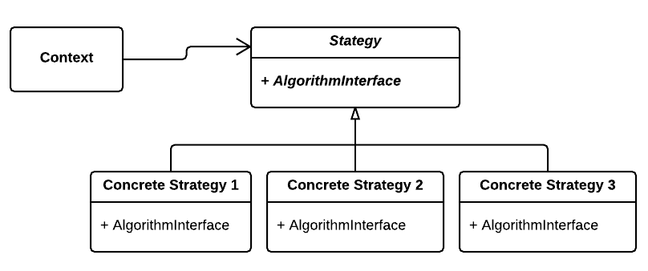

# Strategy Pattern

## Sometimes we say "FUCK YOU" to inheritance

---

## What Are We Building?

Imagine you are building a **payment processing program** that supports multiple payment methods like Credit Card, PayPal, and Cryptocurrency.  
The user can select their preferred payment method, and the program will process the payment accordingly.

The tricky part?  
You want to be able to **switch payment methods at runtime** without restarting or recreating the entire payment processor object, and without bloating your code with many subclasses or complex `if-else` logic.

This is where the **Strategy Pattern** shines.

---

## Overview

The **Strategy Pattern** is a behavioral design pattern that allows you to define a family of algorithms, encapsulate each one, and make them interchangeable.  
The context (main class) delegates the work to whichever algorithm object it is given, without knowing the details of that algorithm.

In short:

> Instead of hardcoding an algorithm inside a class, we pass it in as an object that follows a shared interface, and we can swap it at runtime.

---
## Diagram 

---
## Why Not Just Use Inheritance?

Inheritance can work if you choose your algorithm **at compile time**, but it has serious drawbacks when flexibility is required:

- The algorithm is **tied to the type of object**
- Changing the algorithm often requires **creating a whole new object** of a different subclass
- If the context class has **state**, you risk losing it when creating a new object
- Adding new algorithms means **modifying** the base or context - violating the **Open/Closed Principle**
- Memory cleanup is manual when using raw pointers

---

## Why Strategy Is Better

With the Strategy Pattern:
- The context **keeps its state** and swaps algorithms dynamically
- The algorithm is **decoupled** from the context
- New algorithms can be added **without touching the context class**
- Smart pointers (`std::shared_ptr`) handle memory automatically
- Fully supports **OCP** from SOLID principles

---

## Understanding the Code

### 1. [without_example.cpp](./without_example.cpp) - Inheritance-Based Approach 

**Code explanation:**
- `PaymentProcessor` is a base class with a virtual method `processPayment()`
- Subclasses `CreditCardProcessor`, `PayPalProcessor`, and `CryptoProcessor` override `processPayment()` to provide specific payment algorithms
- In `main()`, you create **different objects** for each payment method
- To switch payment methods, you create a **new object** of the desired subclass

### Why this is bad:

1. **New object per strategy:** Each time you want to switch payment methods, you must create a new object
2. **State loss risk:** If `PaymentProcessor` held any internal state, it would be lost upon switching
3. **Less flexible:** Cannot change the algorithm mid-execution on the same object
4. **Tight coupling:** Adding new payment methods requires subclassing
5. **Manual memory management:** Need to manage `delete` calls carefully

---

### 2. [with_example.cpp](./with_example.cpp) - Strategy Pattern Approach

**Code explanation:**

- Defines an interface `IpaymentStrategy` with pure virtual method `processPayment()`
- Concrete strategies implement this interface with their algorithms
- `PaymentProcessor` holds a `shared_ptr<IpaymentStrategy>` to current strategy
- Can set/change payment method dynamically using `setPaymentMethod()`
- Context calls `process()` which delegates to current strategy

### Why this is good:

1. **Algorithms interchangeable at runtime**
2. **State preservation:** Context remains the same
3. **Open for extension:** New strategies don't require changing existing classes
4. **Memory safety:** `shared_ptr` manages strategy lifetime
5. **Clean code:** Eliminates conditional statements
6. **Follows SOLID principles** (especially Open/Closed Principle)

---

## Key Differences Summary

| Feature                       | Without Strategy (Inheritance)    | With Strategy (Pattern)          |
|------------------------------|----------------------------------|---------------------------------|
| Algorithm change at runtime   | Requires new object               | Change method on existing object|
| State preservation            | Lost when switching objects       | Preserved                      |
| Memory management             | Manual (`delete`)                 | Automatic (`shared_ptr`)         |
| Open/Closed Principle         | Violated when adding new methods  | Fully supported                 |
| Code maintainability          | Lower                           | Higher                          |
| Flexibility                  | Low - fixed at object creation    | High - swap anytime at runtime  |

---

## Analogy

Think of it like a car:

- **Without Strategy Pattern:** Changing the algorithm is like buying a new car just to change the engine.
- **With Strategy Pattern:** You pop the hood and swap the engine, keeping the same car.

---
