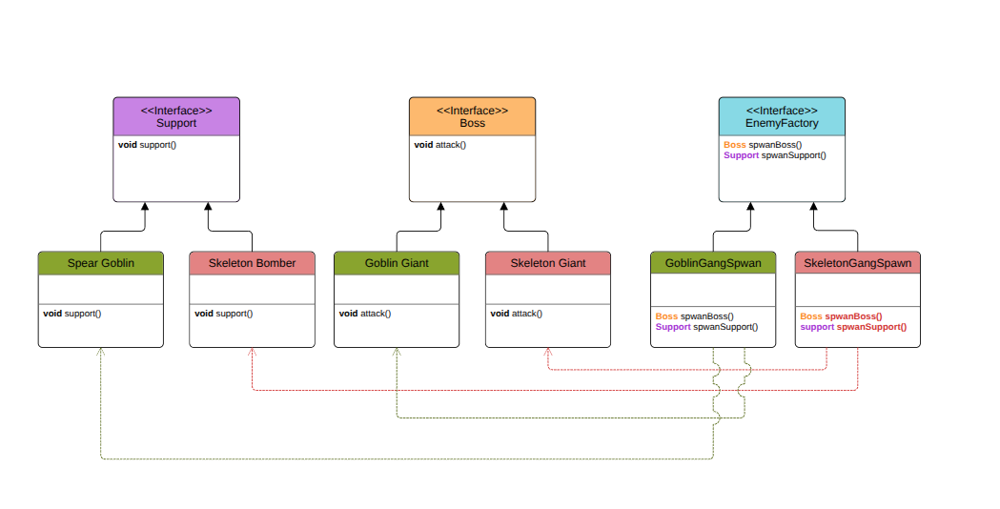

# Abstract Factory Pattern

## Double Trouble: Boss + Support

---

## What Are We Building?

Imagine you’re building a **video game** where each enemy group has **two roles**:

- A **Boss** (big, strong, dangerous)
- A **Support** (helps the boss with special abilities)

For example:

- Skeleton Gang → **Skeleton Giant** (Boss) + **Skeleton Bomber** (Support)
- Goblin Squad → **Goblin Giant** (Boss) + **Spear Goblin** (Support)

The tricky part?  
We don’t want the `main()` function (or the rest of the game) to **know or care** which specific Boss/Support is created.  
We also want to be able to **easily add new enemy gangs** without rewriting the whole game logic.

This is where the **Abstract Factory Pattern** shines.

---

## Overview

The **Abstract Factory Pattern** is a creational design pattern that provides an interface for creating **families of related objects** (Boss + Support in our case) without specifying their concrete classes.

In short:

> Instead of creating each enemy manually, you ask a factory to give you a **matching set** of enemies.  
> Different factories can produce different combinations without changing client code.

---

## Diagram



---

## Why Not Just Use `new` Directly?

Direct instantiation works for small games, but it quickly causes **maintenance headaches**:

- Object creation logic is **tightly coupled** to the client
- Adding a new enemy gang means **modifying every part** of the code that creates enemies
- Risk of mixing **mismatched pairs** (e.g., Skeleton Boss + Goblin Support)
- Hard to swap entire enemy families without rewriting logic

---

## Why Abstract Factory Is Better

With the Abstract Factory Pattern:

- **Centralized creation logic**: all related objects are made in one place
- **Decoupled client**: `main()` doesn’t know about concrete classes
- **Consistency**: Boss and Support always match
- **Easily extensible**: add new gangs without touching existing code
- **Follows Open/Closed Principle (OCP)**: existing code stays closed to modification but open for extension

---

## Understanding the Code

### 1. [without_example.cpp](./without_example.cpp) - Bad Example

**Code explanation:**

- `main()` uses `if/else` to decide which Boss and Support to spawn
- Every time we add a new gang, we modify `main()`
- Creation logic for Boss and Support is **scattered** in the client code

**Why this is bad:**

1. **Tight coupling**: client knows all concrete classes
2. **Code duplication**: multiple `if/else` conditions repeated
3. **Risk of inconsistency**: accidentally pairing wrong Boss/Support
4. **Low scalability**: adding gangs means editing many files

---

### 2. [with_example.cpp](./with_example.cpp) - Abstract Factory Approach

**Code explanation:**

- `IBoss` and `ISupport` → abstract product interfaces
- Concrete products:  
  - Skeleton Giant / Goblin Giant (Bosses)  
  - Skeleton Bomber / Spear Goblin (Supports)
- `IEnemyFactory` → abstract factory interface
- `SkeletonGangFactory` and `GoblinSquadFactory` → concrete factories
- Client code (`main()`) just calls:
  ```cpp
  factory->spawnBoss();
  factory->spawnSupport();
## Why This Is Good

- **Centralized creation**: each factory produces a full matching set  
- **Decoupled client**: no knowledge of concrete class names  
- **Easily extensible**: add a new factory for a new gang  
- **Safe pairing**: factory guarantees Boss + Support match  
- **Supports OCP**: no changes to existing code for new gangs  

---

## Key Differences Summary

| Feature                  | Without Abstract Factory  | With Abstract Factory    |
| ------------------------ | ------------------------- | ------------------------ |
| Object creation location | Spread across client code | Centralized in factories |
| Adding new gang          | Modify many files         | Add new factory only     |
| Code duplication         | High                      | Low                      |
| Flexibility              | Low                       | High                     |
| Boss/Support consistency | Not guaranteed            | Always guaranteed        |
| Follows OCP              | No                        | Yes                      |

---

## Analogy

Think of it like a **game merchandise shop**:

- **Without Abstract Factory:** You buy a Boss toy from one seller and a Support toy from another.  they might not match in theme or scale.  
- **With Abstract Factory:** You buy a complete set from one shop. Boss and Support always match perfectly.
