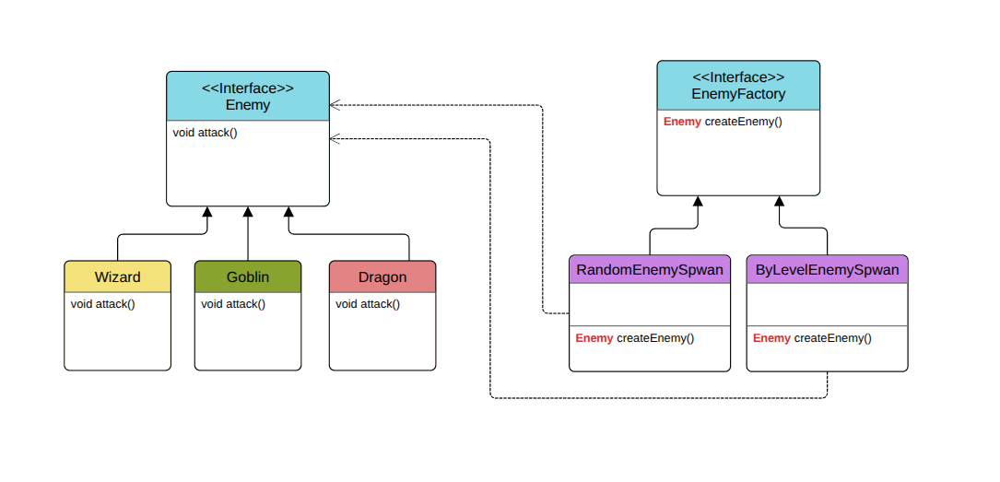

# Factory Method Pattern

## Sometimes we tell `new` تريح شوية

---

## What Are We Building?

Imagine you’re building a **video game** where enemies spawn in different ways:

- Sometimes **randomly** (Goblin, Dragon, Wizard)
- Sometimes **based on player level** (low levels get Goblins, high levels get Wizards, etc.)

The tricky part?  
You don’t want your `main()` function (or any other part of the game) to **know or care** about the details of how enemies are created.  
You also want to be able to **easily add new enemy types** without touching the spawning logic everywhere in your code.

This is where the **Factory Method Pattern** shines.

---

## Overview

The **Factory Method Pattern** is a creational design pattern that defines an interface for creating an object but lets subclasses decide which object to create.

In short:

> Instead of instantiating objects (`new` / `make_shared`) directly in your code, you **delegate creation to a factory method**. Different factories can produce different objects without changing the client code.

---

## Diagram

---

## Why Not Just Use `new` Directly?

Direct instantiation works for tiny projects, but it has **serious drawbacks**:

- Object creation logic is **tightly coupled** to the client
- Adding a new type means **modifying every place** that creates objects
- Duplicated `if/else` or `switch` blocks for different creation rules
- Hard to swap creation strategies (e.g., random vs. level-based) without rewriting code

---

## Why Factory Method Is Better

With the Factory Method Pattern:

- **Creation logic is centralized** in one place
- **Client code is decoupled** from concrete classes
- You can **easily swap factories** to change how objects are created
- Adding new products **does not require changing client code**
- Supports **Open/Closed Principle** from SOLID

---

## Understanding the Code

### 1. [without_example.cpp](./without_example.cpp) - Bad Example

**Code explanation:**

- `main()` directly uses `rand()` and `if/else` to create enemies
- Every time we add a new enemy, we modify `main()` and possibly multiple other files
- Multiple spawn logics mean duplicated code blocks

**Why this is bad:**

1. **Tight coupling** : client knows about every enemy type
2. **Code duplication** : multiple creation conditions spread across codebase
3. **Low scalability** : adding new types means editing many files
4. **Hard to maintain** : logic scattered everywhere

---

### 2. [with_example.cpp](./with_example.cpp) - Factory Method Approach

**Code explanation:**

- `Ienemy` is the product interface
- Concrete enemies: `Goblin`, `Dragon`, `Wizard`
- `IEnemyFactory` is the abstract factory
- `randomEnemySpawn` and `byLevelEnemySpawn` implement the factory method
- Client code (`main()`) just calls `factory->createEnemy()`

**Why this is good:**

1. **Centralized creation** : factories handle object instantiation
2. **Decoupled client** : client doesn’t know about concrete classes
3. **Easily extensible** : new enemies require adding new classes only
4. **Swappable factories** : change spawning rules without touching client code
5. **Supports OCP** : no need to modify existing code for new behaviors

---

## Key Differences Summary

| Feature                  | Without Factory Method    | With Factory Method      |
| ------------------------ | ------------------------- | ------------------------ |
| Object creation location | Spread across client code | Centralized in factories |
| Adding new product type  | Modify many files         | Add new class only       |
| Code duplication         | High                      | Low                      |
| Flexibility              | Low                       | High                     |
| Follows OCP              | no                        | yes                      |

---

## Analogy

Think of it like a **restaurant**:

- **Without Factory Method:** Every table has to cook its own food. inconsistency, no scalability.
- **With Factory Method:** Orders go through the kitchen (factory), which decides how to prepare the dish. You just eat.

---
