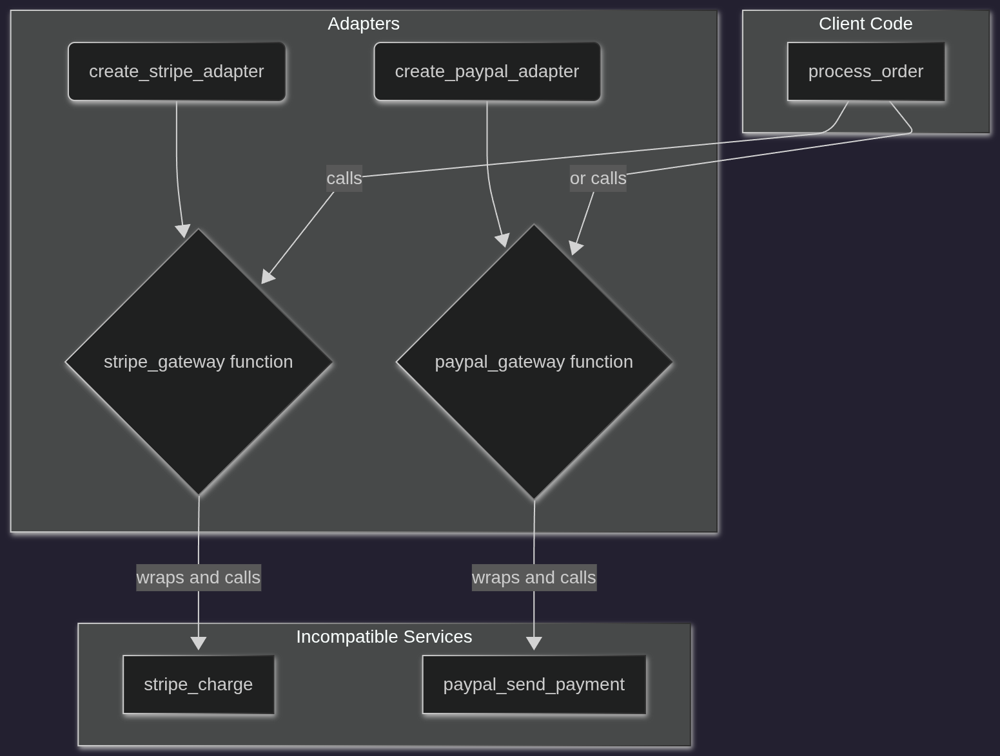

# Adapter Pattern (Functional Edition)

## Making functions play nice together

## What Are We Building?

Just like before, we're building a backend for an **e-commerce store**. Our application needs to process payments, but our payment providers offer functions with totally different signatures:

* **Stripe** has a function: `stripe_charge(card_details: str, amount_cents: int)`
* **PayPal** has a different one: `paypal_send_payment(email: str, amount_dollars: float)`

The tricky part?

You don’t want your `process_order()` function to get bogged down in the messy details of how each payment function needs to be called.

You also want to be able to **easily add new payment providers** without rewriting your core logic every time.

This is where the **Adapter Pattern**, with a functional twist, comes to the rescue.

## Overview

The **Adapter Pattern** is a structural design pattern that allows functions with **incompatible signatures** to work together. In a functional approach, we use a higher-order function as a translator.

In short:

> Instead of writing messy `if/elif` blocks to handle every different function, you **create a "creator" function for each one that returns a new, standardized function**. The rest of your application then calls this standard function without ever knowing about the original.

## Why Not Just Use `if/elif` Directly?

Handling each case with `if/elif` works for a couple of functions, but it quickly becomes a nightmare:

* Your main logic (`process_order`) is **tightly coupled** to every external service's function signature.
* Adding a new payment provider means **modifying the `if/elif` block** in your core logic.
* You end up **duplicating logic** (like converting dollars to cents) inside the client function.
* The code becomes a complex, unmaintainable mess.

## Why The Functional Adapter Is Better

With the functional Adapter Pattern:

* **Client code is decoupled** from the details of the external functions.
* **Translation logic is centralized** inside each adapter-creator function.
* **All services are used consistently** through a single, standard function signature.
* Adding new providers **does not require changing client code**.
* It beautifully supports the **Open/Closed Principle**.
---

## Diagram

## 

---
## Understanding the Code

### 1. [without_example_fp.py](./without_example_fp.py) - Bad Example

**Code explanation:**

* `process_order()` has a big `if/elif/else` block to figure out which payment function to call.
* It contains specific logic for both Stripe (currency conversion) and PayPal right inside it.
* To add a new provider, you *must* modify this function, which is a big no-no.

**Why this is bad:**

1.  **Tight coupling**: `process_order` knows the exact signature of every payment function.
2.  **Scattered logic**: The dollar-to-cents conversion for Stripe is stuck in the client code.
3.  **Low scalability**: Adding more providers makes the function bloated and hard to read.
4.  **Violates OCP**: The function is always open for modification.

### 2. [with_example_fp.py](./with_example_fp.py) - Functional Adapter Approach

**Code explanation:**

* Our "Target Interface" is just a type alias: `PaymentFunction = Callable[[float], None]`. This is our standard.
* `create_stripe_adapter` and `create_paypal_adapter` are higher-order functions. They take the necessary details (like a card number) and return a *new function* that perfectly matches the `PaymentFunction` signature.
* The client code (`process_order()`) is now super simple. It just calls whatever function it's given:
    ```
    payment_gateway(total_amount)
    ```

**Why this is good:**

1.  **Decoupled client**: `process_order` has no idea `stripe_charge` or `paypal_send_payment` exist. It only knows it gets a function it can call with one argument.
2.  **Centralized translation**: The `create_stripe_adapter` function handles the currency conversion logic internally using a closure.
3.  **Easily extensible**: Add a `create_square_adapter` function without touching a single line of existing code.
4.  **Clean and Pythonic**: This approach uses closures and first-class functions, which is very idiomatic in Python.
5.  **Supports OCP**: We can add new functionality without modifying old, tested code.

## Key Differences Summary

| Feature                 | Without Adapter (`if/elif`)  | With Functional Adapter      |
| ----------------------- | ---------------------------- | ---------------------------- |
| Logic Location          | Cluttered in the client code | Contained in adapter creators|
| Adding a New Provider   | Modify existing `if` block   | Add one new creator function |
| Knowledge of Services   | Client knows every signature | Client knows one signature   |
| Flexibility             | Low                          | High                         |

## Analogy

The analogy is the same, because the concept is the same!

Think of it like a **travel power adapter**:

* **Without Adapter Pattern:** Your laptop has a US plug. You go to Europe and the plug doesn't fit the wall socket. You'd have to rewire your laptop on the spot.
* **With Adapter Pattern:** You use a universal travel adapter. Your laptop always plugs into the same standard interface (the adapter), and the adapter handles the job of fitting into any wall socket in the world.