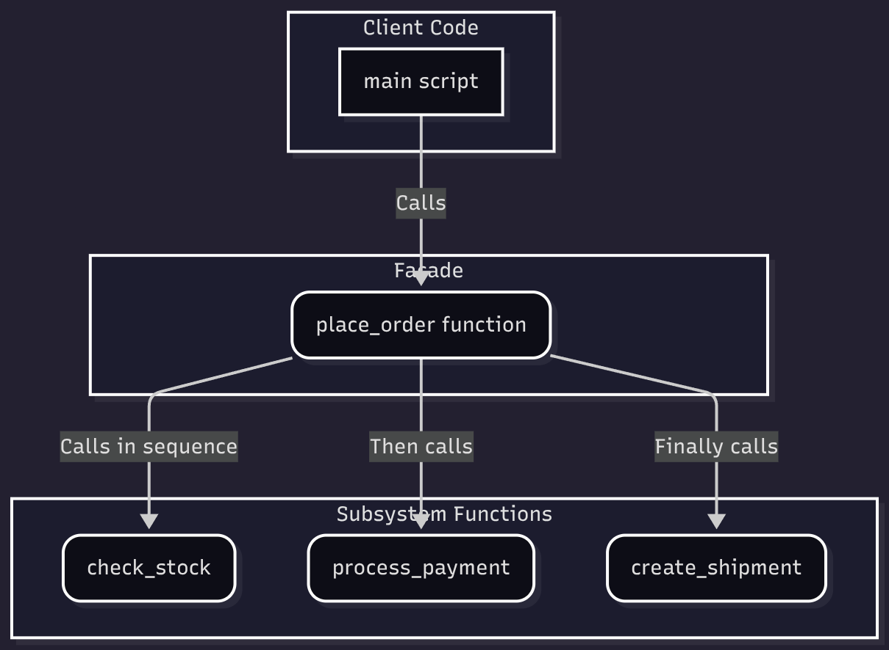

# Facade Pattern (Functional Edition)

## A simple front for a complex system

## What Are We Building?

We're building the backend for our **e-commerce store**. When a user clicks "Buy", our application needs to do a lot of things:

* **Subsystem 1:** `check_stock(item_id, quantity)`
* **Subsystem 2:** `process_payment(card_details, amount)`
* **Subsystem 3:** `create_shipment(item_id, address)`

The tricky part?

You don’t want your main application logic (the client) to get bogged down in the messy details of *which order* to call these functions, how to handle their *outputs*, and what to do *if one fails*.

You also want to be able to **easily add a new step** (like `send_confirmation_email()`) without rewriting your client code every time.

This is where the **Facade Pattern**, with a functional twist, comes to the rescue.

## Overview

The **Facade Pattern** is a structural design pattern that provides a simplified, high-level function to a more complex set of low-level "subsystem" functions. In a functional approach, this "facade" is just a single function that orchestrates all the other functions.

In short:

> Instead of your client code calling ten different functions in a specific, fragile order, you create **one `facade_function()`** that does the complex orchestration for you. The client only calls that one function.

## Why Not Just Call the Functions Directly?

Handling each step in the client code (e.g., in your `main` script) works for a simple process, but it quickly becomes a nightmare:

* Your main logic (`main`) is **tightly coupled** to the entire order-placing *process*.
* If you need to add a new step (e.g., `send_confirmation_email`), you have to **find and modify this logic in every place** an order is processed.
* You end up **duplicating this complex logic** if you need to place an order from more than one place (e.g., from a web request and an admin panel).
* The client code becomes bloated with low-level details, making it hard to read and maintain.

## Why The Functional Facade Is Better

With the functional Facade Pattern:

* **Client code is decoupled** from the *process*. It only knows about the one `place_order()` function.
* **Process logic is centralized** inside the single facade function.
* **It's easy to maintain**. Need to add an email step? You only modify the `place_order` function.
* **Code is DRY** (Don't Repeat Yourself). The complex logic is written *once*.
* The client code is **clean and readable**, expressing its *intent* (place an order) rather than its *implementation* (check stock, then charge, then ship...).
* It beautifully supports the **Single Responsibility Principle**.

---

## Diagram

## 

---

## Understanding the Code

### 1. [without_example_fp.py](./without_example_fp.py) - Bad Example

**Code explanation:**

* The `main` script (the client) imports and calls `check_stock`, `process_payment`, and `create_shipment` directly.
* It contains all the nested `if` statements and error-handling logic for the *entire process*.
* If we want to place an order from another script, we'd have to copy and paste this entire block of logic.

**Why this is bad:**

1.  **Tight coupling**: `main` knows the exact implementation details of placing an order.
2.  **Scattered logic**: The "how to place an order" logic is stuck in the client, not in a dedicated place.
3.  **Low reusability**: This logic block is not reusable without copy-pasting.
4.  **Violates SRP**: The client's responsibility is to *initiate* the order, not to *orchestrate* every step of the order.

### 2. [with_example_fp.py](./with_example_fp.py) - Functional Facade Approach

**Code explanation:**

* We create a single function: `place_order()`. This is our Facade.
* This one function contains all the complex orchestration logic: it calls `check_stock`, then `process_payment`, and finally `create_shipment`, handling the flow between them.
* The client code (`main`) is now super simple. It just calls the facade function:
    ```python
    # Client code is simple:
    place_order(
        product_id="shampoo", 
        quantity=2, 
        credit_card="1", 
        price=50.00, 
        address="..."
    )
    ```

**Why this is good:**

1.  **Decoupled client**: `main` has no idea `check_stock` or the other subsystems exist. It only knows about `place_order`.
2.  **Centralized logic**: The entire order process is in one, easy-to-find place.
3.  **Easy to modify**: Need to add an `send_email()` step? You add it *one time* inside `place_order`.
4.  **Clean and Pythonic**: The client code is simple, readable, and focused on its own job.

## Key Differences Summary

| Feature                 | Without Facade (Direct Calls) | With Functional Facade       |
| ----------------------- | ----------------------------- | ---------------------------- |
| Process Logic Location  | Cluttered in the client code (`main`) | Contained in the Facade function |
| Client Knowledge        | Knows all subsystem functions | Knows *one* Facade function  |
| Adding a New Step       | Modify *every client* | Modify *one* Facade function |
| Code Duplication        | High risk                     | Low (DRY)                    |
| Readability             | Low (implementation details)  | High (shows intent)          |

## Analogy

Think of a **waiter at a restaurant**.

* **Without Facade:** You (the client) would have to go directly to the kitchen and give your food order to the `Chef` (Subsystem 1). Then, you'd walk to the bar and give your drink order to the `Bartender` (Subsystem 2). Finally, you'd have to find the `Host` (Subsystem 3) to pay. You have to know the whole complex process.

* **With Facade:** You just talk to the `Waiter` (the Facade). You give them one simple, unified request: "I'd like the steak and a soda." The waiter handles all the complex orchestration for you—talking to the chef, the bartender, and the host. Your interaction is simple and clean.