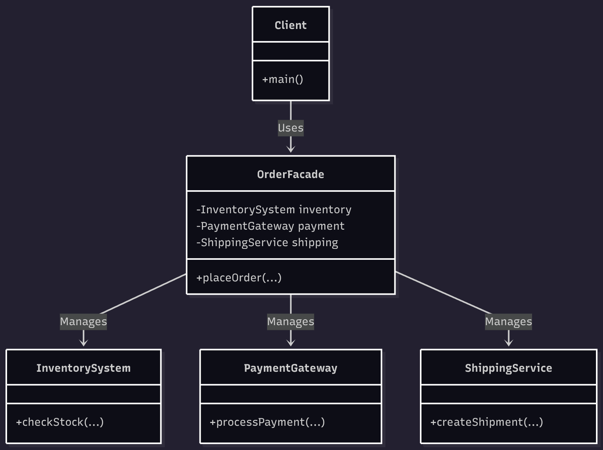

# Facade Pattern

## A simple front for a complex system (just talk to that guy he knows how to do it)

## What Are We Building?

We're building the backend for our **e-commerce store**. When a user clicks "Buy", our application needs to coordinate several complex subsystems, each represented by its own class:

* **Subsystem 1:** `InventorySystem` class (methods: `checkStock()`)
* **Subsystem 2:** `PaymentGateway` class (methods: `processPayment()`)
* **Subsystem 3:** `ShippingService` class (methods: `createShipment()`)

The tricky part?

You don’t want your client code (like your `main()` function or a `WebController` class) to get bogged down in the messy details of *which order* to instantiate these classes, how to pass data between them, and what to do *if one fails*.

You also want to be able to **easily add a new step** (like an `EmailService` class) without rewriting your client code every time.

This is where the **Facade Pattern**, in its classic OOP form, comes to the rescue.

## Overview

The **Facade Pattern** is a structural design pattern that provides a simplified, unified interface (a single class) to a more complex set of subsystems (a group of other classes). This new class, the "Facade," encapsulates all the complex interactions.

In short:

> Instead of your client code having to instantiate and call ten different subsystem classes in a specific, fragile order, you create **one `Facade` class** that does the complex orchestration for you. The client only talks to the Facade.

## Why Not Just Call the Classes Directly?

Handling each step in the client code works for a simple process, but it quickly becomes a nightmare:

* Your main logic (`main` or `WebController`) is **tightly coupled** to every single subsystem class.
* If you need to add a new step (e..g., `EmailService`), you have to **find and modify this logic in every place** an order is processed.
* You end up **duplicating this complex logic** if you need to place an order from more than one place (e.g., from a web request and an admin panel).
* The client class becomes bloated with low-level responsibilities, violating the **Single Responsibility Principle (SRP)**.

## Why The OOP Facade Is Better

With the OOP Facade Pattern:

* **Client code is decoupled** from the *subsystems*. It only needs to know about the `OrderFacade` class.
* **Orchestration logic is centralized** and encapsulated inside the `OrderFacade` class's methods.
* **It's easy to maintain**. Need to add an `EmailService`? You add it as a private member *inside* the Facade. The client code doesn't change at all.
* **Code is DRY** (Don't Repeat Yourself). The complex logic is written *once*.
* The client code is **clean and readable**, expressing its *intent* (place an order) rather than its *implementation* (create inventory, then create payment...).

---

## Diagram

## 

---

## Understanding the Code

### 1. [without_example.cpp](./without_example.cpp) - Bad Example

**Code explanation:**

* The `main()` function (the client) creates instances of `InventorySystem`, `PaymentGateway`, and `ShippingService` directly.
* It contains all the nested `if` statements and logic to figure out which methods to call and in what order.
* If we want to place an order from another part of the code, we'd have to copy and paste this entire block of logic.

**Why this is bad:**

1.  **Tight coupling**: `main` knows about *every* subsystem. If `ShippingService`'s constructor changes, `main` breaks.
2.  **Scattered logic**: The "how to place an order" logic is stuck in the client, not in a dedicated domain object.
3.  **Low reusability**: This logic block is not reusable without copy-pasting.
4.  **Violates SRP**: The client's responsibility is to *initiate* the order, not to *orchestrate* every step of the order.

### 2. [with_example.cpp](./with_example.cpp) - OOP Facade Approach

**Code explanation:**

* We create a single class: `OrderFacade`.
* In its constructor, it creates and *holds* the instances of all the subsystems (this is **Composition**).
* It exposes one simple public method: `placeOrder()`. All the complex orchestration (the `if` statements, the sequential calls) is hidden *inside* this method.
* The client code (`main()`) is now super simple. It just creates one object and calls one method:
    ```cpp
    // Client code is simple:
    OrderFacade* orderFacade = new OrderFacade();
    orderFacade->placeOrder(...);
    delete orderFacade;
    ```

**Why this is good:**

1.  **Decoupled client**: `main` has no idea `InventorySystem` or the others exist. It only knows about `OrderFacade`.
2.  **Centralized logic**: The entire order process is encapsulated in one, easy-to-find class.
3.  **Easy to modify**: Need to add an `EmailService`? You add a private `EmailService*` member to the Facade and call it inside `placeOrder()`. `main` is untouched.
4.  **Clean and Robust**: The client code is simple, readable, and less brittle.

## Key Differences Summary

| Feature                 | Without Facade (Direct Calls) | With OOP Facade              |
| ----------------------- | ----------------------------- | ---------------------------- |
| Process Logic Location  | Cluttered in the client class (`main`)| Encapsulated in the Facade class |
| Client Knowledge        | Knows all subsystem classes   | Knows *one* Facade class     |
| Adding a New Step       | Modify *every client* | Modify *one* Facade class    |
| Coupling                | High (Client -> Subsystems)   | Low (Client -> Facade)       |
| Readability             | Low (implementation details)  | High (shows intent)          |

## Analogy

Think of a **waiter at a restaurant**.

* **Without Facade:** You (the client) would have to go directly to the kitchen and give your food order to the `Chef` (Subsystem 1). Then, you'd walk to the bar and give your drink order to the `Bartender` (Subsystem 2). Finally, you'd have to find the `Host` (Subsystem 3) to pay. You have to know the whole complex process and all the people involved.

* **With Facade:** You just talk to the `Waiter` (the Facade). You give them one simple, unified request: "I'd like the steak and a soda." The `Waiter` class holds references to the `Chef`, `Bartender`, and `Host` and handles all the complex orchestration for you. Your interaction is simple and clean.